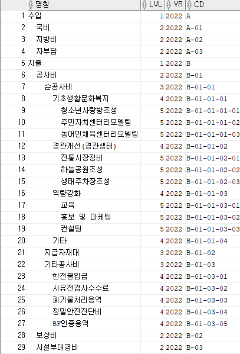

Hierarchical Query 계층형 쿼리
==============================
#### 1. 계층형쿼리
* 한 테이블에 담겨 있는 여러 레코드들이 서로 상하 관계(부모, 자식) 관계를 이루며 존재할 때, 이 관계에 따라 레코드를 hierarchical(상하위) 한 구조로 가져올 때 사용되는 SQL
***
#### 2. START WITH ~ CONNECT BY, LEVEL, CONNECT_BY_ISLEAF
* START WITH : 계층 질의의 루트(부모행)로 사용될 행을 지정
* CONNECT BY : 계층 질의에서 상위계층(부모행)과 하위계층(자식행)의 관계를 규정
* LEVEL : 계층구조 쿼리에서 수행 결과의 Depth 표현
* CONNECT_BY_ISLEAF : 더이상 하위에 연결된 노드가 없는 항목 구분
***
#### 3. 예시
```
SELECT
    LPAD(' ',2 * (LEVEL - 1)) || CD_NM as 명칭,
    LEVEL LVL,
    A.*,
    DECODE(CONNECT_BY_ISLEAF,1,'true','false') AS LEAF,
    CASE WHEN LEVEL < TO_NUMBER('5') THEN 'true' ELSE 'false' END AS EXPANDED
FROM
    (SELECT YR, CD, CD_NM, PJT_CD, COST, RMK, ITEM_SEQ, UP_ITEM_SEQ
    FROM EX_TBL_01
    WHERE yr = '2022'
        AND PJT_CD = 'A1101') A
START WITH UP_ITEM_SEQ = '0'
CONNECT BY PRIOR A.ITEM_SEQ = A.UP_ITEM_SEQ
ORDER BY A.CD;
```
<p align="center"> 
    
</p>

***
