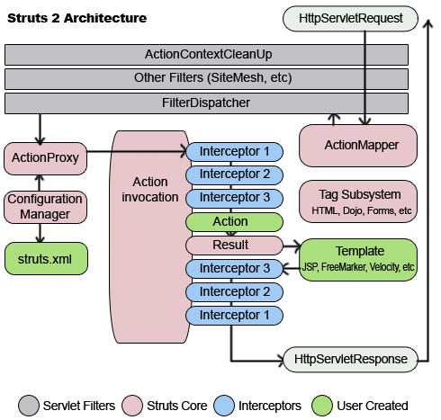

## Struts2 와 Spring MVC의 차이
#### Struts와 Spring 프레임워크의 가장 큰 차이점은 스트럿츠는 웹에 특화된 프레임워크라는 것
#### Struts 프레임워크의 전반적 흐름은  웹 브라우저 사용자가 요청을 하면 서블릿에서 해당 요청을 받으면  structs.xml 설정에 따라 알맞은 액션으로 연결함
#### 이과정에서 인터셉터(보안, 파일업로드 등)에서 요청을 처리한 후 액션에 넘겨지게 됨
#### 액션에서 비즈니스 로직을 수행한 후 수행한 결과를 request객체에 담고 리턴된 포워드로 jsp를 연결하게 됨
#### 이런 일련의 과정들은 HTTP 요청방식에 대한 전반적인 처리를 다룸 즉 웹 환경에만 특화된 것
#### 반면, 스프링 프레임워크는 웹어플리케이션 뿐만 아니라 자바 어플리케이션에도 특화된 프레임워크
#### 기본적으로 컨테이너라는 것을 제공하는데 이 컨테이너는 빈의 생성과 소멸등 일련의 라이프 사이클을 관리하게 됨
#### 환경설정도 Struts 방식처럼 xml로 설정하는 방식뿐만이 아닌 자바 기반의 어노테이션을 활용하여 자바 빈들을 등록할 수 있음
#### 이렇게 등록된 자바 빈은 웹 시스템 뿐만 아닌 어플리케이션에서도 활용 할 수 있음 
#### 스프링은 MVC환경에 특화된 서블릿이나 컨트롤러, 뷰리졸버 등을 제공하는데, 사실상 이러한 것은 웹 환경을 지원하기 위해 제공하는 것임
#### 실질적으로 비즈니스 로직을 실행하는 Service나 Repository같이 자바빈으로 등록된 것 들은 웹 환경이 아닌 어디에서도 사용 가능함
#### 즉, 외부 인터페이스에 확장까지 고려한 프레임워크

### Struts2의 장단점
|장점|단점|
|:---:|:---:|
|단일 진입 서블릿을 사용하여 관리가 용이하다.|Struts 프레임워크를 이해하는데 시간이 많이 걸린다.|
|확장성을 위주로 만들어졌다.|프레임워크를 이용해도 프로그램코드가 줄어드는 것은 아니다.|
|JSTL, JSF 등 표준을 포함하여 버전업 되고 있다.|Struts 태그 라이브러리가 표준은 아니다.|
|여러 통합 개발 환경과 서드파티에서 Struts개발을 지원하고 있다|규모가 커질수록 struts-config.xml이 방대해지고, 무수히 많은 액션클래스가 생긴다.|
### Struts 구조

